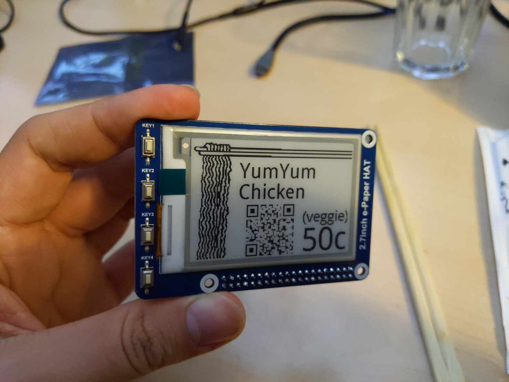

# noodlectl();

one-day-hack to display ramen noodle selection and pricing on a small e-ink
display.



## Hardware

We used the following, but other hardware should work equally well:

* Waveshare 2.7Inch E-Paper,264X176,E-Ink Display HAT for Raspberry Pi 2B/3B/Zero/Zero W,Color:Black,White,SPI Interface
* RaspberryPi Zero W

## Setup

```
$ cd noodlectl
$ python3 -m venv venv
$ source venv/bin/activate
$ pip3 install -r requirements-eink.txt -r requirements-web.txt
$ FLASK_APP=noodlectl.py flask run --host 0.0.0.0
```
